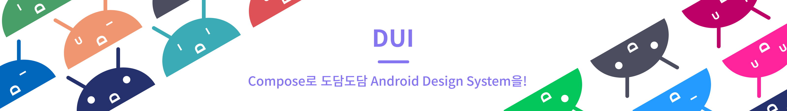

<p align="center">
  
</p>


[](https://github.com/Team-B1ND/dui-android/actions)

> 💡 **DUI란?** </br>
> DUI는 Dodam UI로 도담도담 Android Design System 입니다. </br>
> Jetpack Compose로 개발되었으며 버튼, 캘린더 등 다양한 컴포넌트를 제공합니다. </br>

도담도담, 도담 Teacher, DAuth에 일관된 UI를 적용하기 위해서 개발되었습니다.</br>
DUI의 개발 과정을 보고 싶다면? ([Dodam Android Design System(DUI)](https://minjae1230.notion.site/Dodam-Android-Design-System-DUI-2e6afc9b205d4f37be5d7b8230136c81))

## FEATURE ⚡️
[DUI 사용 가이드](https://minjae1230.notion.site/DUI-GUIDE-f9fac16ca7df4718b68328e83db9479f)</br></br>
[Foundation](https://minjae1230.notion.site/Foundation-d61c793338b744bd93047958a8caba89)</br>
  - icon
  - shape
  - color
  - typo
 ---
[Component](https://minjae1230.notion.site/Component-fcb2c8d585db4c4ab600b7cffa53ff0c)
  - basic
  - set
  - organization

## PLAYGROUND 🛝
app 모듈을 빌드하여 Preview를 볼 수 있습니다.</br>
[dui-android/app at develop · Team-B1ND/dui-android](https://github.com/Team-B1ND/dui-android/tree/develop/app)

## TEAM 😀
B1ND-ANDROID</br>
| 개발자 | 담당 |
| --- | --- |
| **최민재** [@snack655](https://github.com/snack655) | [DUI COMPONENTS](https://github.com/Team-B1ND/dui-android/tree/main/dodam-components) |
| **김도현** [@kdh1123](https://github.com/kdh1123) | [DUI PLAYGROUND](https://github.com/Team-B1ND/dui-android/tree/main/app) |

## START  ⬇️
in your project
```gradle
allprojects {
  repositories {
    ...
    maven { url 'https://jitpack.io' }
  }
}
```

module
```gradle
dependencies {
  implementation 'com.github.Team-B1ND:dui-android:{version}'
}
```
